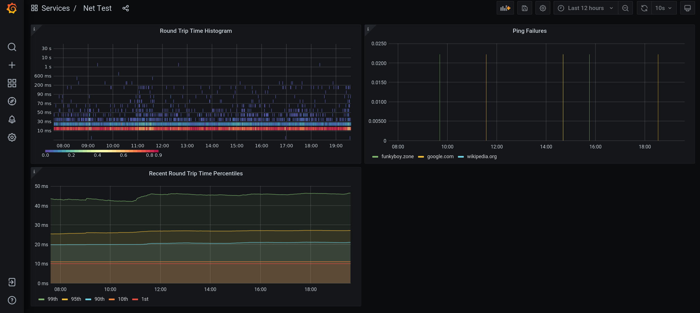

# Net Test
Monitors network connectivity for downtime.

# Table Of Contents
- [Overview](#overview)
- [Run](#run)
  - [Command Line Options](#command-line-options)
  - [Run with Docker Compose](#run-with-docker-compose)
  - [Run Manually](#run-manually)
- [Analyse](#analyse)

# Overview
The `net-test` program performs measurements and publishes the resulting metrics for Prometheus to scrape.

Prometheus and Grafana Docker containers a provided set and ready to analyse and view `net-test` data.



# Run
The `net-test` tool measures results and publishes them for Prometheus. Grafana is used to view the data.

A Docker Compose setup is provided to make this process as easy as running a single tool, see [Run with Docker Compose](#run-with-docker-compose).

If one would like to run the setup without Docker Compose see [Run Manually](#run-manually).

## Command Line Options
The behavior of the `net-test` tool is specified using command line options. 

The tool is configured with a list of target hosts, a host picking strategy, and a set of measurements to take.

Target host options:

- `-t string`: Target hosts (DNS or IP4) to measure for connectivity (can be provided multiple times)
- `-T string`: Add this target host to the beginning of existing target hosts

Host picking strategy:

- `-f`: Only measure the first target host and fallover to other following target hosts if the measurement fails (incompatible with -a) (default true)
- `-a`: Measure all target hosts (incompatible with -f)

Measurement options:

- `-p int`: Interval in milliseconds at which to perform the ping measurement. Will perform 3 ping(s). A value of -1 disables this test. Results recorded to the "ping_rtt_ms" and "ping_failures_total" metrics with the "target_host" label. (default 10000)

Other options:

- `-m string`: Host on which to serve Prometheus metrics (default ":2112")

## Run with Docker Compose
A Docker Compose file is provided which orchestrates the execution of this tool.

Run:

```
docker-compose up -d
```

Then visit [127.0.0.1:3000](http://127.0.0.1:3000) to view the metrics. Select the `Net Test` dashboard.

To customize the command line arguments used to run `net-test` in Docker create a copy of `docker-compose.custom.example.yml` named `docker-compose.custom.yml`. Then edit this file with your custom command. To run with the custom command:

```
docker-compose -f docker-compose.yml -f docker-compose.custom.yml up -d
```

This is a lot to type every time, so the helper script `custom-docker-compose` is provided to make life easier. The following is equivalent to the command above:

```
./custom-docker-compose up -d
```

## Run Manually
The `net-test` tool is written in Go. Run it:

```
go run main.go
```

See [Command Line Options](#command-line-options) for details.

Next run Prometheus and have it scrape the host on which you set `net-test` to publish metrics. By default this is `127.0.0.1:2112`.

Finally run Grafana, use the configuration files provided in the `grafana/` directory.

# Analyse
Measurements are placed in Prometheus. The following measurement types create the following metrics:

**Ping (`-p <ms interval>`)**  
- `ping_rtt_ms` (Histogram, labels `target_host`): Round trip time to target host
- `ping_failures_total` (Count, labels `target_host`): Incremented when a target host cannot be reached

Grafana is hosted at [127.0.0.1:3000](http://127.0.0.1:3000) by the provided Docker containers. A dashboard named "Net Test" has been pre-configured to show all available measurement data.
